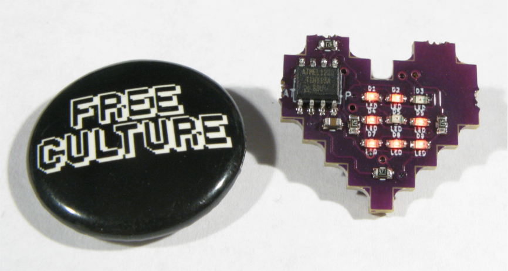
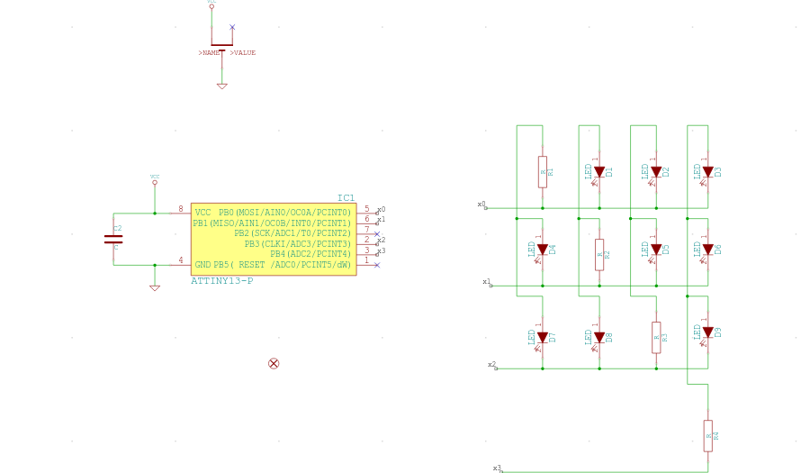
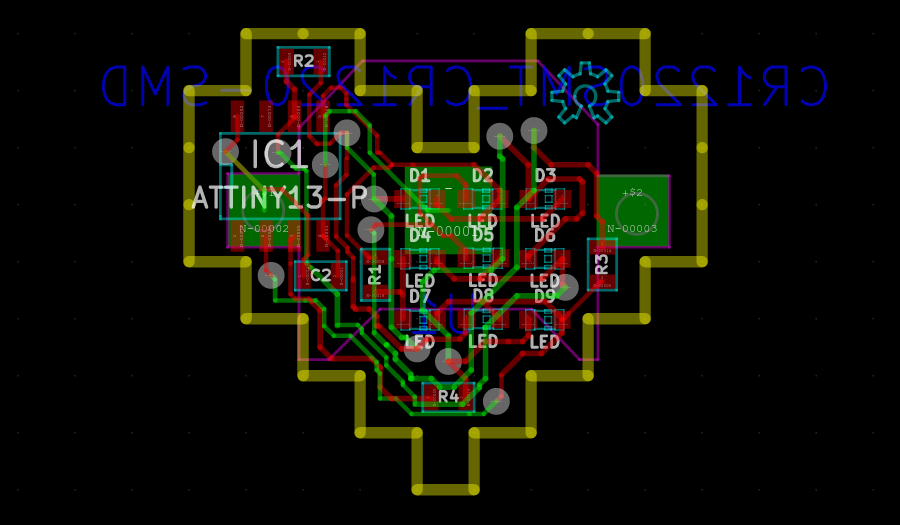

# h8ARt



Code and Gerber files for 3x3 0603 LED heart.

You can see the [project on MeowCAD](https://meowcad.com/project?projectId=12b1cb79-9d14-4319-a8cc-878b5ee93019).

All code is AGPLv3.  Everything else is under CC-BY-SA 3.0 except for qsc-8bit-3x3-2x.png which is under a CC0 license.

## Quick Start

To compile:

```bash
$ ./cmp h8ARt.asm
```

To upload (using usbtinyisp):

```bash
$ sudo ./program_avr.sh h8ARt.ihex
```


## Description

The code is written in assembly and uses an ATTiny13 to drive a 3x3 LED matrix via [Charlieplexing](https://en.wikipedia.org/wiki/Charlieplexing) (I tried writing it in C but it exhausted the 1k on the chip too quickly).

There is a message hard coded that 'scrolls' across the 3x3 LED matrix in a 'ticker tape' fashion.  Currently the message is 'OHS2015'.  The font used is a slightly modified version of [the 3x3 font from user qubodup available on OpenGameArt.org](http://opengameart.org/content/9-pixel-font-3x3).

## BOM

| Part | Count | Link |
|---|---|---|
| ATTiny13 | 1 | [Digikey](http://www.digikey.com/product-detail/en/ATTINY13A-SSUR/ATTINY13A-SSURCT-ND/3789485) |
| Red LED (0603) | 9 | Ebay |
| 470 Ohm Resistor (0603) | 4 | Ebay |
| 4.7 uF Capacitor (0603) | 1 | Ebay |
| CR1216 SMD Battery Holder | 1 | [Digikey](http://www.digikey.com/product-detail/en/BAT-HLD-012-SMT/BAT-HLD-012-SMT-ND/3044013) |
| CR1216 Battery | N | Ebay |

Boards were manufactered through [OSHPark](https://oshpark.com/).

## schematic



## board



## video

[](http://www.youtube.com/watch?v=Gg_DkGkVkSI)

